<div align="center">


# RAG-Relearn

**Retrieval Failure Analysis and Continuous RAG Improvement**

Platform riset AI Engineering yang mendiagnosis *kenapa* RAG salah, lalu **belajar dari kesalahan itu** secara terukur, terdokumentasi, dan bisa direproduksi.


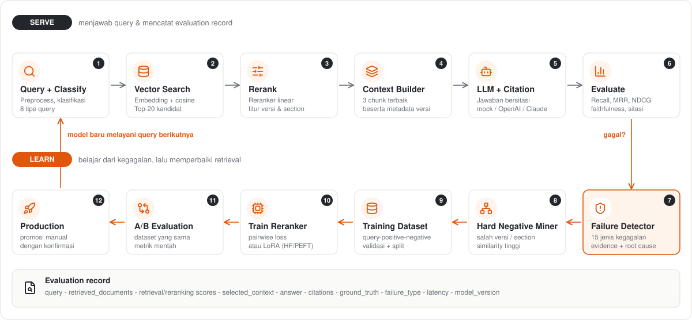

</div>

##  Ringkasan

Kebanyakan proyek RAG berhenti di "chatbot yang menjawab dari dokumen". Masalahnya, RAG sering **gagal diam-diam**: dokumen yang diambil salah versi, salah section, atau mirip secara topik tetapi tidak menjawab pertanyaan, dan tidak ada yang tahu.

RAG-Relearn berfokus pada hal itu:

| Pertanyaan | Jawaban RAG-Relearn |
|---|---|
| Kenapa jawaban ini salah? | **Failure Detector** menandai salah satu dari 15 jenis kegagalan, lengkap dengan *evidence*, *root cause*, dan *recommended action*. |
| Dokumen apa yang menyesatkan retriever? | **Hard Negative Miner** mencari chunk yang mirip tetapi salah (versi lama, section lain, keyword overlap). |
| Bagaimana memperbaikinya? | **Dataset generator** + **trainer** melatih reranker dari pasangan positif/negatif. |
| Apakah model baru benar-benar lebih baik? | **A/B test** dan **Experiments** menampilkan metrik mentah pada dataset yang sama, tanpa memilih pemenang otomatis. |
| Bisakah agen AI memantau ini? | **MCP server** dengan 12 tool untuk observasi dan evaluasi. |

Kasus demo: **SOP Backup Server v1 sampai v4** sengaja ditulis sangat mirip. Baseline memilih versi lama; setelah belajar dari kegagalannya, model memilih versi terbaru.

##  Cara kerja

Sistem berjalan dalam dua jalur: **Serve** (menjawab dan mencatat) dan **Learn** (belajar dari kegagalan). Setiap query disimpan sebagai *evaluation record* yang bisa dianalisis ulang.

| # | Tahap | Modul | Keluaran |
|---|---|---|---|
| 1 | Query + Classify | `ml/retrieval/classifier.py` | tipe query (procedural, version-sensitive, ...) menentukan strategi |
| 2 | Vector Search | `ml/retrieval/retriever.py` | Top-20 kandidat + similarity |
| 3 | Rerank | `ml/reranking/reranker.py` | skor akhir dari fitur: similarity, keyword, **is_latest**, section |
| 4 | Context Builder | `ml/pipeline.py` | 3 chunk terbaik dengan metadata versi |
| 5 | LLM + Citation | `ml/providers.py` | jawaban bersitasi (mock lokal, OpenAI, atau Claude) |
| 6 | Evaluate | `ml/evaluation/` | Recall@K, MRR, NDCG, faithfulness, citation accuracy, latency |
| 7 | Failure Detector | `ml/failure_detection/` | `failure_type`, confidence, evidence, root cause, action |
| 8 | Hard Negative Miner | `ml/hard_negative/miner.py` | negatif sulit + tipe + alasan + quality score |
| 9 | Training Dataset | `ml/hard_negative/dataset.py` | dataset tervalidasi, split tanpa leakage query |
| 10 | Train Reranker | `ml/training/` | bobot baru (pairwise loss) atau LoRA via HF/PEFT |
| 11 | A/B Evaluation | `backend/app/routers/evaluation.py` | selisih metrik antar model |
| 12 | Production | Model Registry | promosi manual dengan konfirmasi |

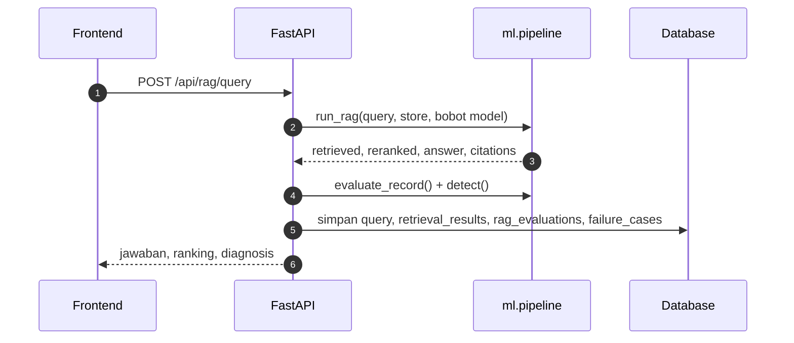

Siklus hidup model di registry:

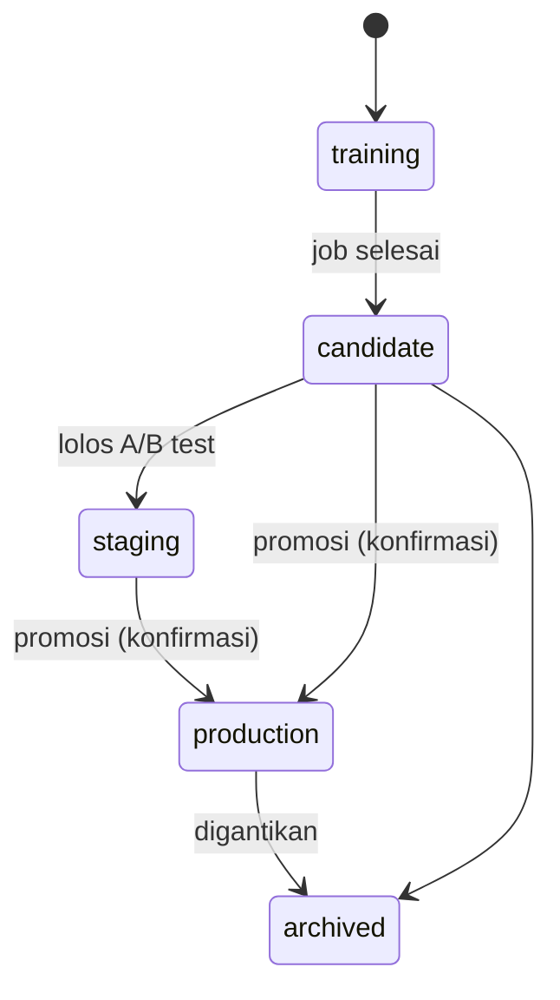

##  Fitur

| | Fitur | Halaman UI |
|---|---|---|
|  | KPI, grafik success rate, distribusi kegagalan, latency, perbandingan model | Dashboard |
|  | Jalankan query, lihat ranking, context window, sitasi, dan diagnosis langsung | RAG Playground |
|  | Dokumen yang diharapkan vs hasil retrieval (tangga peringkat) | Retrieval Analysis |
|  | Tabel kegagalan dengan filter, sort, pagination, dan halaman detail diagnosis | Failure Cases |
|  | Review hard negative: Approve, Reject, Regenerate | Hard Negatives |
|  | Dataset, split train/val/test, validasi kualitas, export JSON/JSONL/CSV | Training Dataset |
|  | Konfigurasi training, kurva loss langsung, mode lightweight atau HF/LoRA | Training Center |
|  | Registry versi model dan promosi status | Models |
|  | Model A vs B pada dataset sama, delta per metrik | A/B Testing |
|  | Evaluasi batch: retrieval, generation, latency, kegagalan | Evaluation |
|  | Empat konfigurasi dibandingkan, hasil lama tidak pernah dihapus | Experiments |
|  | Upload PDF/DOCX/TXT/MD, chunking, metadata versi | Documents |
|  | Coba 12 tool MCP langsung dari UI | MCP Tools |
|  | Konfigurasi aktif dan observabilitas (request, error rate, token) | System Settings |

Pendukung: JWT + role (viewer, researcher, admin), validasi upload (tipe dan 10 MB), sanitasi konten, `request_id` pada setiap request, structured logging, provider LLM yang bisa diganti.

##  Demo version mismatch

Query: **"Bagaimana prosedur backup server?"**. Ground truth adalah `SOP_Backup_v4_section_3`. Angka di bawah diambil dari data seed asli.

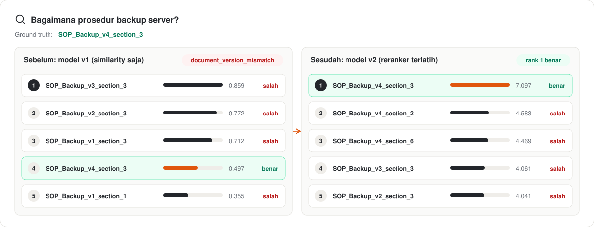

Yang terjadi:

1. Model v1 hanya memakai similarity, jadi `SOP_Backup_v3` (0.859) mengalahkan `v4` (0.497). Detector menandai `document_version_mismatch`.
2. Dari kegagalan v1 pada query-query training yang serupa (misalnya "Prosedur pencadangan data server rumah sakit"), versi lama (v1, v2, v3) ditambang sebagai **hard negative**. Query demo di atas sendiri tidak dipakai untuk training.
3. Reranker dilatih dari pasangan tersebut. Bobot fitur `is_latest` naik dari 0 ke sekitar 3, dan `section_match` juga naik:

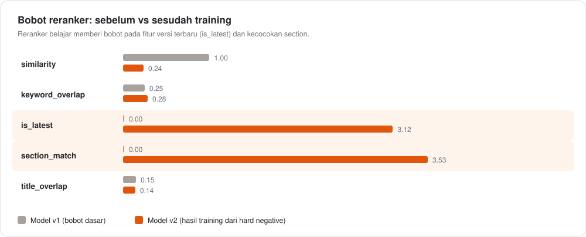

4. Model v2 menaruh `SOP_Backup_v4_section_3` di rank 1.

##  Hasil eksperimen

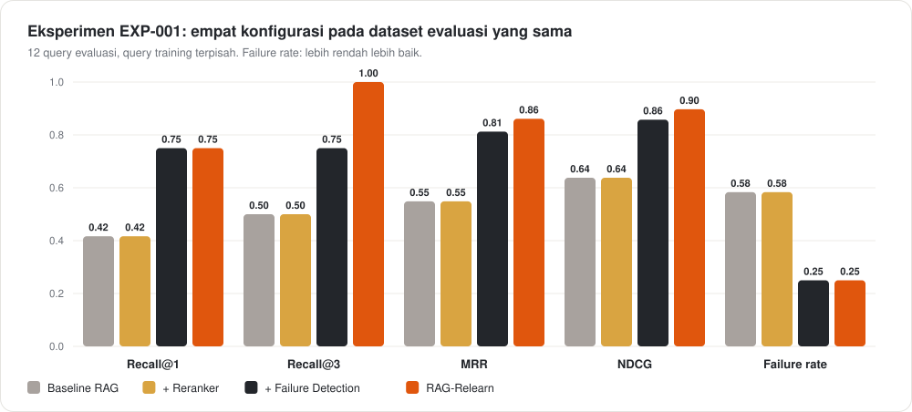

| Metrik | Baseline | + Reranker | + Failure Detection | **RAG-Relearn** |
|---|---|---|---|---|
| Recall@1 | 0.42 | 0.42 | 0.75 | **0.75** |
| Recall@3 | 0.50 | 0.50 | 0.75 | **1.00** |
| MRR | 0.55 | 0.55 | 0.81 | **0.86** |
| NDCG | 0.64 | 0.64 | 0.86 | **0.90** |
| Failure rate (lebih rendah lebih baik) | 0.58 | 0.58 | 0.25 | **0.25** |

Cara membaca hasil ini dengan jujur:

- **+ Reranker** identik dengan baseline karena bobot dasarnya belum punya sinyal versi. Reranker baru berguna setelah dilatih.
- **+ Failure Detection** adalah heuristik runtime (*version guard*), bukan hasil training. Ia sudah menyelesaikan sebagian besar kasus versi, sedangkan RAG-Relearn unggul di Recall@3, MRR, dan NDCG.
- Query **training** (`data/train_queries.json`) dipisah dari query **evaluasi** (`data/eval_dataset.json`), jadi tidak ada kebocoran query.
- Dataset evaluasi hanya 12 query dan didominasi kasus versi, jadi ini bukti konsep pipeline, bukan klaim performa umum. Pada demo di atas, rank 2 dan 3 juga diisi section lain dari v4 karena model sangat condong ke `is_latest`.

##  Tampilan aplikasi

Screenshot di bawah diambil dari aplikasi yang berjalan dengan data seed.

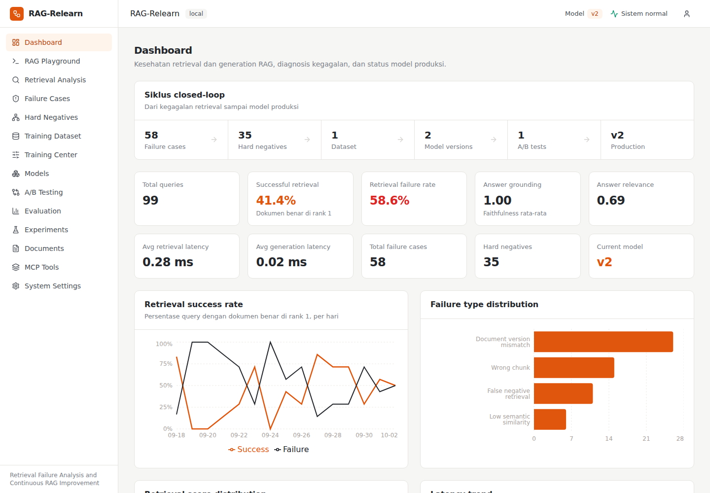

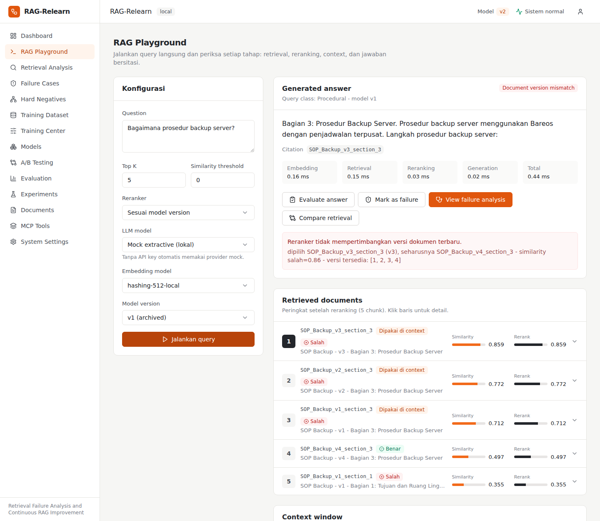

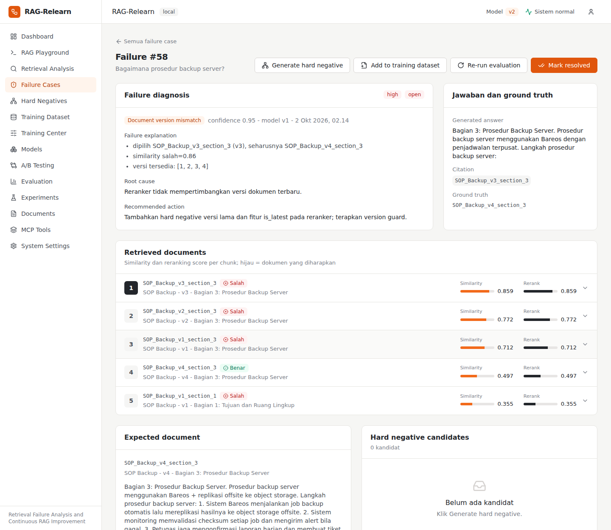

<details>
<summary><b>Lihat halaman lainnya</b></summary>

<br>

**Hard Negatives**

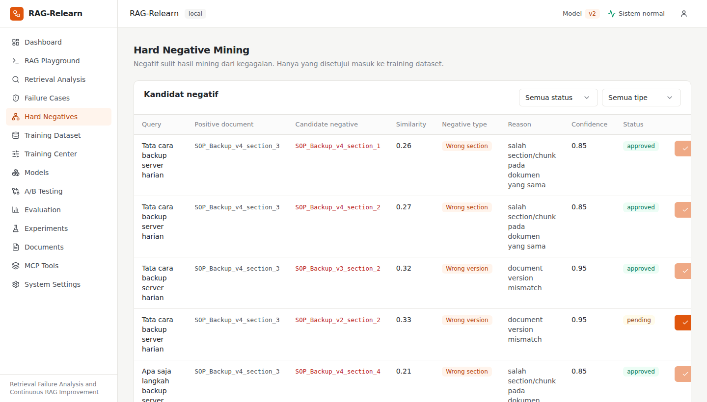

**Training Center**

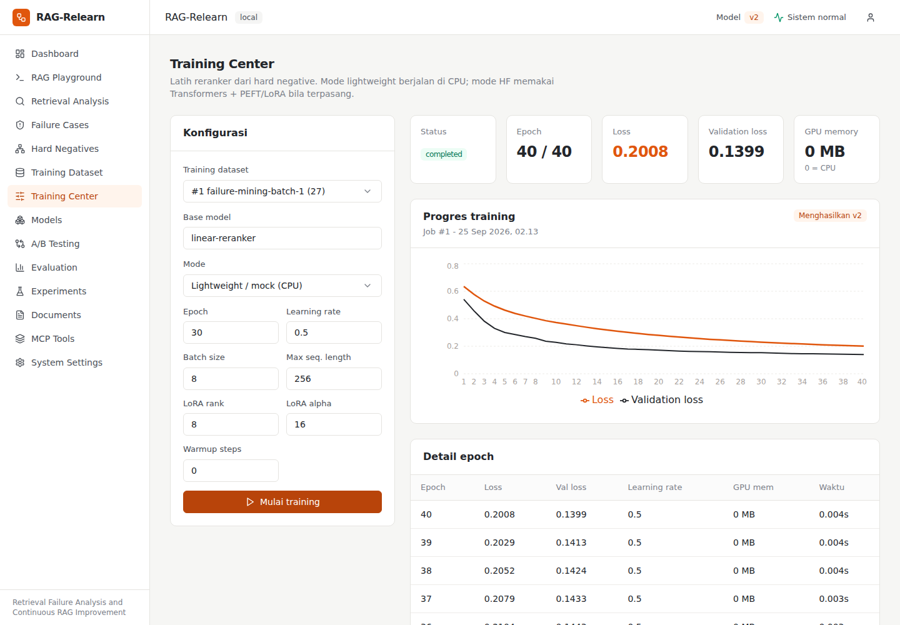

**A/B Testing**

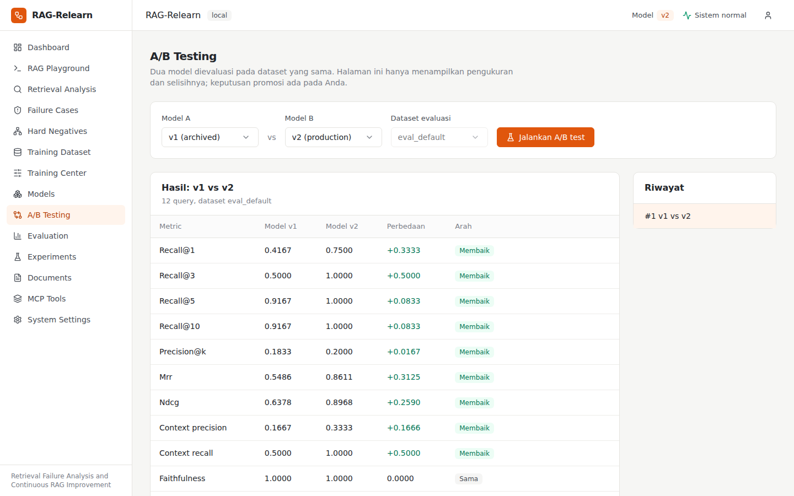

**Experiments**

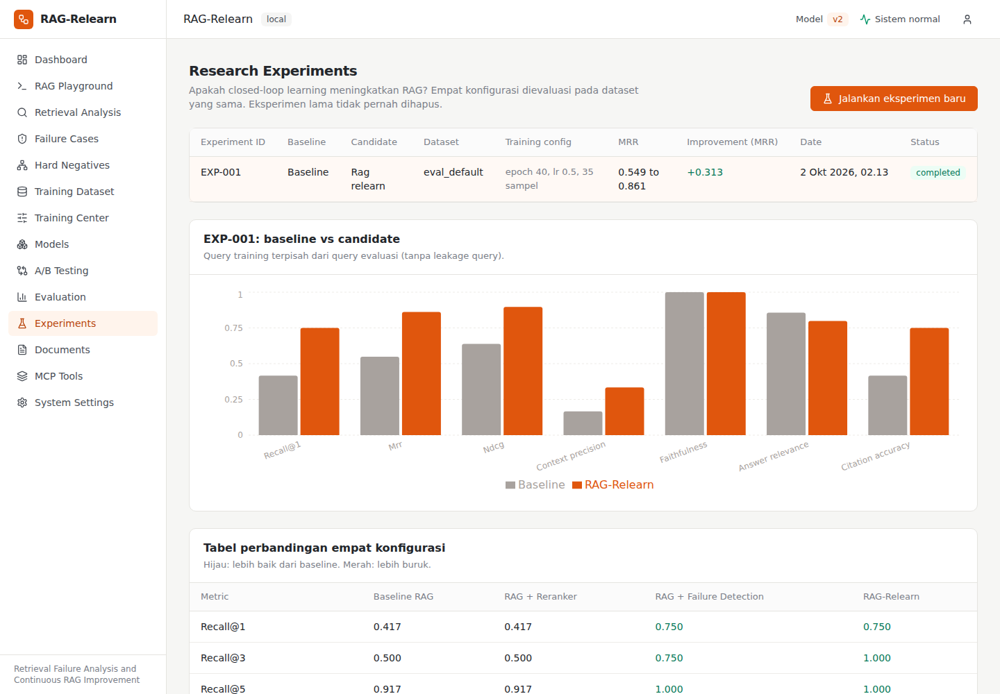

**Documents**

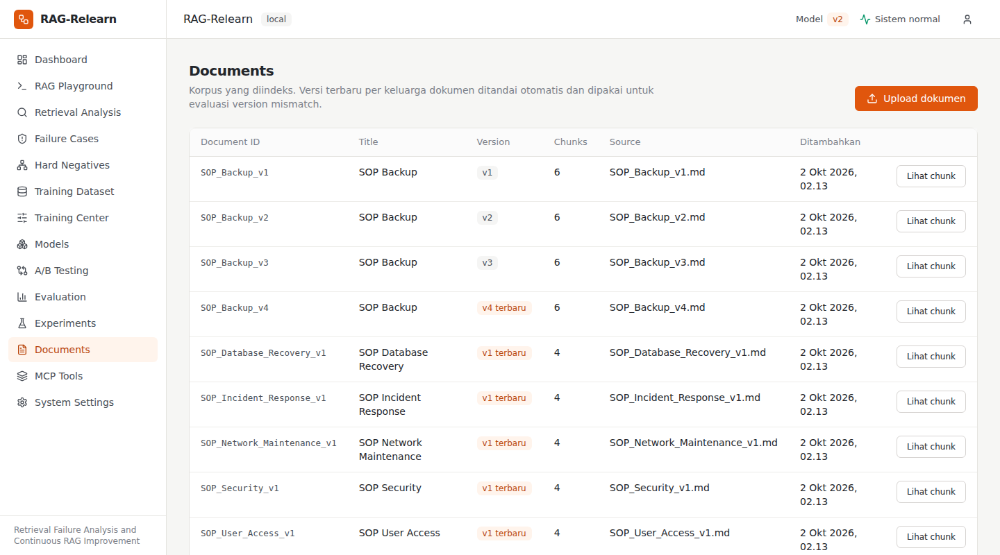

</details>

##  Arsitektur

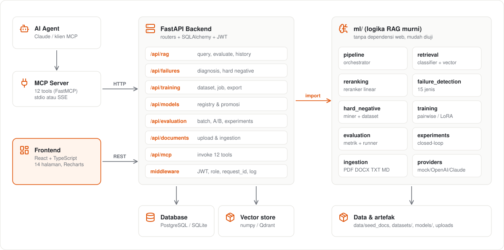

##  Quick start

**Prasyarat:** Python (conda atau venv) dan Node.js 18+.

```bash
# 1. Masuk ke root proyek (folder yang berisi backend/, frontend/, ml/)
cd rag-relearn

# 2. Buat environment (sekali saja)
conda create -n ragrelearn python=3.11 -y
conda activate ragrelearn

# 3. Install dependensi backend - jalankan dari ROOT proyek
python -m pip install -r backend/requirements.txt

# 4. Seed database demo (SQLite)
cd backend
python -m app.seed

# 5. Jalankan backend
uvicorn app.main:app --reload --port 8000
```

Buka **terminal kedua** untuk frontend:

```bash
cd rag-relearn/frontend
npm install
npm run dev
```

Buka **http://localhost:5173**. Dokumentasi API interaktif ada di http://localhost:8000/docs.

**Checklist berhasil:**

- [ ] `python -m app.seed` mencetak `Seed selesai: {'docs': 9, 'chunks': 44, 'queries': 98, ...}`
- [ ] http://localhost:8000/api/health menampilkan `{"status":"ok", ...}`
- [ ] Dashboard terisi grafik, dan navbar menampilkan `Sistem normal` serta model `v2`

**Alternatif tanpa conda:** `python3 -m venv .venv && source .venv/bin/activate`, lalu langkah 3 dan seterusnya sama. Skrip `./scripts/dev.sh` menjalankan semuanya sekaligus.

**Alternatif Docker** (PostgreSQL + Qdrant + backend + MCP + frontend):

```bash
cp .env.example .env     # opsional; tanpa API key otomatis memakai provider mock
docker compose up --build
```

Frontend di http://localhost:3000. Konfigurasi Docker belum diverifikasi end-to-end oleh penulis, jadi jalur lokal di atas adalah yang teruji.

##  Troubleshooting

| Gejala | Penyebab | Solusi |
|---|---|---|
| `No module named 'sqlalchemy'` atau pesan "Dependensi belum terpasang" | Paket belum di-install di environment aktif | `python -m pip install -r backend/requirements.txt` dari **root** proyek |
| `Could not open requirements file: requirements.txt` | Salah folder | File ada di `backend/`. Dari root: `-r backend/requirements.txt`; dari dalam `backend/`: `-r requirements.txt` |
| `unsupported operand type(s) for \|` | Python lama dengan kode versi sebelumnya | Pakai versi proyek terbaru (sudah kompatibel Python 3.9+) atau Python 3.11 |
| `psycopg2-binary` gagal build | Hanya dibutuhkan untuk PostgreSQL | Hapus baris itu dari `backend/requirements.txt` untuk mode SQLite |
| Frontend: "Data gagal dimuat" | Backend belum jalan | Jalankan `uvicorn app.main:app --reload --port 8000` |
| Dashboard kosong | Seed belum dijalankan | `cd backend && python -m app.seed --reset` |
| `mcp` tidak bisa di-install | SDK MCP butuh Python 3.10+ | Jalankan MCP server di environment Python 3.11 |
| Terminal macOS: `chsh` / pesan zsh | Hanya pemberitahuan shell | Abaikan, atau `conda init zsh` lalu buka terminal baru |

##  MCP server

Agen AI dapat mengamati dan mengevaluasi sistem lewat 12 tool: `evaluate_rag`, `inspect_retrieval`, `get_failure_cases`, `get_failure_case`, `generate_training_set`, `generate_hard_negatives`, `run_ab_test`, `compare_models`, `get_model_metrics`, `get_rag_metrics`, `trigger_retraining`, `get_training_status`.

```bash
pip install -r mcp-server/requirements.txt          # Python 3.10+
BACKEND_URL=http://localhost:8000 python mcp-server/server.py     # stdio
MCP_TRANSPORT=sse python mcp-server/server.py                     # HTTP :8765
```

Konfigurasi klien MCP (stdio):

```json
{ "mcpServers": { "rag-relearn": { "command": "python", "args": ["mcp-server/server.py"], "env": { "BACKEND_URL": "http://localhost:8000" } } } }
```

`trigger_retraining` hanya menghasilkan model `candidate`. Promosi ke production tetap keputusan manusia.

##  API

Dokumentasi lengkap di `/docs` (Swagger). Endpoint utama:

| Area | Endpoint |
|---|---|
| RAG | `POST /api/rag/query`, `POST /api/rag/evaluate`, `GET /api/rag/history`, `GET /api/retrieval/{query_id}` |
| Failure | `GET /api/failures`, `GET /api/failures/{id}`, `POST /api/failures/{id}/hard-negative` |
| Training | `POST /api/training/dataset`, `GET /api/training/datasets`, `POST /api/training/start`, `GET /api/training/{job_id}` |
| Model | `GET /api/models`, `POST /api/models/register`, `POST /api/models/{id}/status` |
| Evaluasi | `POST /api/evaluation/run`, `GET /api/evaluation/{id}`, `POST /api/ab-test`, `GET /api/ab-test/{id}`, `GET /api/experiments` |
| Lainnya | `POST /api/documents/upload`, `GET /api/dashboard/metrics`, `POST /api/mcp/invoke`, `POST /api/auth/login` |

Contoh evaluasi dan A/B dari terminal:

```bash
curl -X POST localhost:8000/api/evaluation/run -H 'content-type: application/json' -d '{"model_version":"v2"}'
curl -X POST localhost:8000/api/ab-test -H 'content-type: application/json' -d '{"model_a":"v1","model_b":"v2"}'
curl -X POST "localhost:8000/api/experiments/run?epochs=40"
```

## Konfigurasi

Salin `.env.example` menjadi `.env`. Tanpa `OPENAI_API_KEY` atau `ANTHROPIC_API_KEY`, aplikasi memakai embedding hashing lokal dan generator extractive mock, jadi tetap berjalan penuh. Provider LLM berpola `ml/providers.py` (tambah Ollama atau HF dengan mengimplementasikan `LLMProvider.generate`). Aktifkan `AUTH_ENABLED=true` dan ganti `JWT_SECRET` untuk penggunaan di luar demo.

Fine-tuning cross-encoder LoRA nyata: `pip install -r ml/requirements-train.txt`, lalu `python -m ml.training.hf_lora_trainer datasets/train.jsonl`. Tanpa GPU otomatis memakai CPU.

##  Pengujian

```bash
python -m pip install -r backend/requirements.txt
python -m pytest -q      # 26 test
```

Mencakup ingestion, chunking, embedding, retrieval, reranking, failure detection, hard negative mining, dataset (termasuk leakage), evaluasi, API, tool MCP, dan satu **integrasi closed-loop** (query, retrieval, evaluasi, deteksi kegagalan, dataset, training, evaluasi ulang). Test dijalankan lulus di Python 3.9 dan 3.12.

Regenerasi aset README: `python scripts/generate_readme_assets.py` (diagram dari data seed) dan `python scripts/capture_screenshots.py` (screenshot, butuh Playwright dan kedua server berjalan).

##  Batasan yang jujur

- Embedding hashing lokal dan reranker linear dipilih agar berjalan tanpa GPU atau API key. Kualitas absolutnya bukan state of the art.
- Dataset evaluasi kecil (12 query) dan didominasi kasus versi dokumen. Hasil eksperimen adalah bukti konsep pipeline, bukan klaim generalisasi.
- Reranker hasil training sangat condong ke fitur `is_latest`; ia bisa menaikkan section lain dari versi terbaru di atas section yang benar dari versi lama. Dataset yang lebih beragam diperlukan untuk menyeimbangkannya.
- Vector store default berupa numpy in-memory dari tabel `document_chunks`. Antarmuka `VectorStore` siap diganti Qdrant atau pgvector, tetapi adapter-nya belum dibuat.
- Mode HF/LoRA tersedia sebagai modul terpisah dan belum dijalankan pada seed karena membutuhkan torch.
- Docker Compose belum diverifikasi end-to-end.

## Roadmap

- [ ] Adapter Qdrant / pgvector
- [ ] Dataset evaluasi lebih besar dan beragam (bukan hanya versi dokumen)
- [ ] Embedding model sungguhan (sentence-transformers) sebagai provider
- [ ] Menjalankan fine-tuning cross-encoder LoRA pada dataset hasil mining
- [ ] CI GitHub Actions untuk test dan build frontend

---

<div align="center">

Dibuat sebagai proyek portofolio AI Engineer: fokus pada **diagnosis kegagalan RAG** dan **peningkatan retrieval yang terukur**.

</div>
